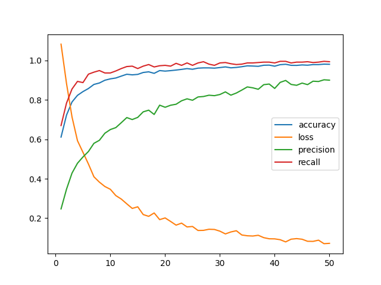
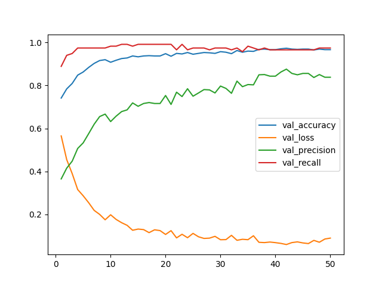

# NASA Asteroid Classifier

A web app that fetches recent near-Earth objects from NASA and runs them through a trained ML model to predict whether they are potentially hazardous.

**Live demo:** https://nasa-asteroid-classifier-production-5776.up.railway.app




## How it works

The backend model is a binary classification neural network built with Keras and trained on NASA's historical NEO dataset. It takes orbital and physical features as input (eccentricity, miss distance, velocity, diameter, etc.) and outputs a hazard probability.

The frontend is a Next.js app that calls the NASA NeoWs API to get the 5 most recent asteroids, sends each one to the deployed model API, and displays the results alongside NASA's own hazard classification.

## Stack

- **Model:** Keras (TensorFlow), scikit-learn, Python
- **API:** FastAPI, deployed on Railway
- **Frontend:** Next.js, Mantine

## Running locally

**Backend**
```bash
cd backend
pip install -r requirements.txt
uvicorn src.server:app --reload
```

**Frontend**
```bash
cd frontend/nasa-asteroid-classifier
npm install
npm run dev
```

Create a `.env.local` file in `frontend/nasa-asteroid-classifier` with:
```
NASA_API_KEY=your_nasa_api_key
PREDICT_API_URL=your_model_api_url
```

You can get a free NASA API key at [api.nasa.gov](https://api.nasa.gov).
